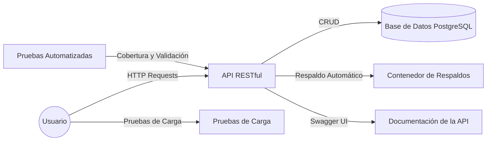

# Sistema de Gestión de Inventario

## Descripción

Este proyecto consiste en una API REST para gestionar el inventario de una cadena de tiendas minoristas. Permite gestionar productos, transferir inventarios entre sucursales y configurar alertas de stock bajo.


## Instrucciones de Instalación

### Requisitos Previos
1. **Instalar Docker y Docker Compose**:
  Instálalos desde [https://docs.docker.com/get-docker/](https://docs.docker.com/get-docker/)  
   - Asegúrate de tener Docker y Docker Compose instalados en tu máquina.
   - Verifica que Docker esté funcionando ejecutando:
     ```bash
     docker --version
     docker-compose --version
     ```

2. Clonar este repositorio:
   ```bash
   git clone https://github.com/ohsalmeron/Inventory-API.git
   cd Inventory-API

### Levantar los Contenedores
1. **Ejecutar el comando principal**  
   - Construye y levanta los contenedores con un solo comando:
     ```bash
     docker-compose up --build
     ```

2. **Alta de servicios**  
   - El proyecto incluye un archivo `init.sql` para inicializar la base de datos, `.env` con las variables de entorno necesarias, así como los requerimientos de Python en `requirements.txt`.  
   - Una vez ejecutado el comando anterior, todos los servicios estarán activos automáticamente:
     - Base de datos PostgreSQL
     - Restful API de inventario
     - Sistema de respaldos automáticos
     - Pruebas automatizadas
     - Herramienta de pruebas de carga (Locust)

## Verificación de Componentes

### 1. **Pruebas Automatizadas**

- Las pruebas se ejecutan automáticamente al levantar los contenedores. Los resultados se muestran en la consola.

1. **Ver los resultados de las pruebas**:

   - Observa los resultados de las pruebas unitarias e integración en la consola. Ejemplo:
     ```plaintext
     ============================= test session starts ==============================
     platform linux -- Python 3.10.16, pytest-8.3.4, pluggy-1.5.0
     rootdir: /app
     plugins: anyio-4.7.0, cov-6.0.0
     collected 27 items

     tests/test_system.py ...........................                         [100%]

     ============================== 27 passed in 0.55s ==============================
     ```

2. **Explorar el código de las pruebas**:
   - Puedes revisar el código fuente de las pruebas en el directorio `tests/`:
     ```bash
     tree tests/
     ```

3. **Detalles de cobertura**:
   - Los reportes de cobertura se generan automáticamente y están disponibles en el directorio `coverage/`:
     ```bash
     ls coverage/
     ```

- **Notas**:
  - Las pruebas abarcan casos unitarios e integración para los endpoints principales.
  - Cualquier fallo en las pruebas será reportado directamente en la consola durante el despliegue.


### 2. **Documentación de la API**

- La API cuenta con documentación generada automáticamente en formato OpenAPI (Swagger).  
- Puedes acceder a la documentación desde tu navegador en la siguiente URL: [http://localhost:8000/docs](http://localhost:8000/docs)
- Si necesitas el esquema JSON de la API, está disponible en: [http://localhost:8000/openapi.json](http://localhost:8000/openapi.json)
- Se incluye una **Colección de POSTMAN** en la raíz del directorio `Inventory Management API.postman_collection.json`

**Principales Endpoints:**

- **Gestión de Productos**  
  - `GET /api/products`: Lista productos con filtros (categoría, precio, stock) y paginación.  
  - `GET /api/products/{id}`: Obtener detalles de un producto.  
  - `POST /api/products`: Crear un nuevo producto (validando campos obligatorios).  
  - `PUT /api/products/{id}`: Actualizar un producto existente.  
  - `DELETE /api/products/{id}`: Eliminar un producto.

- **Gestión de Inventario**  
  - `GET /api/stores/{id}/inventory`: Listar inventario por tienda.  
  - `POST /api/inventory/transfer`: Transferir productos entre tiendas, validando stock disponible.  
  - `GET /api/inventory/alerts`: Listar productos con stock bajo (por debajo de `minStock`).


### 3. **Pruebas de Carga con Locust**

- Accede a la interfaz de usuario de Locust para configurar y ejecutar pruebas de carga en la siguiente URL:  
  [http://localhost:8089/](http://localhost:8089/)

- Se recomienda configurar las pruebas siguiendo las mejores prácticas:
  - **Number of Users** (peak concurrency): 500 o más usuarios simultaneos
  - **Ramp up** (users added per sec): De 10 hasta un máximo de 100 usuarios agregados por segundo.
  - **Host** (URL interna de docker) para las pruebas de carga: `http://inventory_api:8000`

### 4. **Backups Automatizados**

- El servicio de respaldos automáticos está configurado con un **cron** dentro del contenedor `inventory_db_backup`.  
- Para verificar la programación de los respaldos, ingresa al contenedor y ejecuta el siguiente comando:

  ```bash
  docker exec -it inventory_db_backup bash
  crontab -l
  ```

- Los respaldos se generan diariamente en el directorio /backups dentro del contenedor.

Cada archivo tiene un nombre con formato: `inventory_backup_YYYYMMDD_HHMMSS.sql.`

Si necesitas realizar un respaldo manual, usa este comando:

  ```bash
  docker exec -it inventory_db_backup bash
  PGPASSWORD=postgres pg_dump -U postgres -h inventory_db inventory > /backups/respaldo_manual.sql
  ```

- Los respaldos generados pueden revisarse en el directorio de backups:

  ```bash
  docker exec -it inventory_db_backup bash
  ls /backups
  ```

### 5. **Acceso y Verificación de la Base de Datos**

- Para ingresar al contenedor de la base de datos y ejecutar comandos SQL manualmente, sigue estos pasos:

1. Accede al contenedor de la base de datos:
  ```bash
  docker exec -it inventory_db bash
  psql -U postgres -d inventory
  ```

Una vez dentro del cliente de PostgreSQL, puedes ejecutar comandos SQL. Por ejemplo:

Mostrar todas las tablas:
  ```bash
  \dt
  ```

- El contenedor inventory_db contiene toda la información de productos, inventarios y movimientos.

## Decisiones Tomadas Durante el Desarrollo

### Tecnologías utilizadas

1. **Lenguaje y Framework**:
   - **Lenguaje**: Python 3.10.
   - **Framework**: FastAPI por su eficiencia, soporte para OpenAPI/Swagger y facilidad de desarrollo para APIs RESTful.

       **Python fue elegido basado en la primera entrevista** en donde se solicitaba, sin embargo también se puede realizar en **.NET, NodeJS/Express o Java/Spring Boot** de acuerdo a los requerimientos técnicos de la empresa. Otros frameworks de Python disponibles que puedo manejar son Flask y Django.

       Para edge tecnologies se recomienda usar Rust o Motoko para combinar lógica y bases de datos con seguridad criptográfica.

2. **Base de Datos**:
   - Se utilizó **PostgreSQL** por la familiaridad con bases de datos relacionales, aunque MongoDB también es viable en este tipo de proyectos.

3. **Infraestructura Dockerizada**:
   - Uso de **Docker Compose** para orquestar los servicios: base de datos, API, respaldos y pruebas de carga.
   - Contenedores configurados para ser portables y de fácil despliegue en entornos locales o en la nube.

4. **Gestión de Respaldos**:
   - Configuración de un contenedor dedicado para ejecutar respaldos automáticos usando `pg_dump` y tareas programadas con `cron`.
   - Opción de realizar respaldos manuales en caso de requerirse.
   - Se utiliza un contenedor por separado para cubrir casos single points of failure.

5. **Pruebas**:
   - Cobertura amplia para pruebas unitarias automatizadas utilizando `pytest`, usando Seeds y también datos guardados y parseados dentro de las funciones.
   - Pruebas de carga manuales implementadas con **Locust** para asegurar la escalabilidad de la API bajo condiciones de alta concurrencia.

6. **Documentación**:
   - Generación automática de documentación en formato `OpenAPI/Swagger` para facilitar la integración de clientes con la API.

7. **Variables de Entorno**:
   - Gestión centralizada de variables de entorno y librerías a través de `.env` y `requirements.txt` para facilitar la configuración en diferentes entornos.

8. **Logs Estructurados**:
   - Configuración de logs en formato JSON con `python-json-logger` para integrarse con herramientas de monitoreo y depuración. 

### Diagrama de Arquitectura



**Descripción**:
- Los usuarios interactúan con la API RESTful para realizar operaciones CRUD.
- La API está respaldada por una base de datos PostgreSQL y un sistema de respaldos automáticos.
- Las pruebas de carga se ejecutan con Locust, simulando múltiples usuarios concurrentes.
- La documentación está accesible a través de una interfaz Swagger generada automáticamente.
- Pruebas unitarias y de integración validan la funcionalidad de la API.

## Recomendaciones de Despliegue en la Nube

### Opción 1: Despliegue con Kubernetes en Google Cloud/AWS/Azure

**Ventajas de Usar Kubernetes**
1. **Escalabilidad Automática**: Kubernetes permite escalar horizontal y verticalmente los recursos según la carga del sistema.
2. **Gestión Simplificada**: Kubernetes automatiza actualizaciones, parches y monitoreo del clúster, reduciendo la sobrecarga operativa.
3. **Alta Disponibilidad**: Si alguna app llegara a fallar, se replica el pod original automáticamente para mantener el servicio activo.

**Instrucciones de Despliegue**:
1. **Requerimientos Previos**:
   - Configurar una cuenta en Google Cloud, AWS o Azure.
   - Tener configuradas las herramientas CLI necesarias (`kubectl`, `gcloud` o las equivalentes en otras plataformas).
   - Crear un clúster de Kubernetes con al menos 3 nodos (2 CPU, 8 GB RAM recomendados por nodo).

2. **Subir el Contenedor al Registro**:
   - Taggear la imagen para el registro de contenedores:
     ```bash
     docker tag inventory_api gcr.io/PROYECTO/inventory-api:latest
     ```
   - Subir la imagen al registro de contenedores:
     ```bash
     docker push gcr.io/PROYECTO/inventory-api:latest
     ```

3. **Desplegar con Kubernetes**:
   - Crear un archivo de configuración `deployment.yaml`:
     ```yaml
     apiVersion: apps/v1
     kind: Deployment
     metadata:
       name: inventory-api
     spec:
       replicas: 3
       selector:
         matchLabels:
           app: inventory-api
       template:
         metadata:
           labels:
             app: inventory-api
         spec:
           containers:
           - name: inventory-api
             image: gcr.io/PROYECTO/inventory-api:latest
             ports:
             - containerPort: 8000
      apiVersion: v1
        kind: Service
        metadata:
          name: inventory-api-service
        spec:
          selector:
            app: inventory-api
          ports:
          - protocol: TCP
            port: 80
            targetPort: 8000
          type: LoadBalancer


   - Aplicar la configuración:
     ```bash
     kubectl apply -f deployment.yaml
     ```

4. **Verificar el Despliegue**:
   - Listar los pods:
     ```bash
     kubectl get pods
     ```
   - Obtener la IP del balanceador de carga para acceder a la API:
     ```bash
     kubectl get svc inventory-api-service
     ```

---

### Opción 2: Despliegue con Docker en DigitalOcean

**Ventajas de Usar DigitalOcean con Docker**
1. **Simplicidad**: Un droplet con Docker permite un despliegue directo y rápido.
2. **Costo Eficiente**: Ideal para proyectos pequeños o pruebas con requerimientos moderados.
3. **Flexibilidad**: Control total sobre la configuración del servidor.

**Instrucciones de Despliegue**:
1. **Requerimientos Previos**:
   - Crear una cuenta en [DigitalOcean](https://www.digitalocean.com).
   - Configurar acceso SSH y subir tu llave pública a DigitalOcean.

2. **Crear un Droplet**:
   - Seleccionar la imagen de Ubuntu (20.04 o superior) con al menos 2 CPUs y 4 GB de RAM.
   - Asociar la llave SSH configurada previamente.

3. **Instalar Docker y Docker Compose**:
   - Conectar al droplet por SSH:
     ```bash
     ssh root@<DROPLET_IP>
     ```
   - Instalar Docker:
     ```bash
     apt update && apt install -y docker.io
     ```
   - Instalar Docker Compose:
     ```bash
     apt install -y docker-compose
     ```

4. **Clonar el Proyecto y Levantar los Contenedores**:
   - Clonar el repositorio y construir los contenedores:
     ```bash
     git clone <https://github.com/ohsalmeron/Inventory-API.git>
     cd Inventory-API
     docker-compose up --build -d
     ```

5. **Acceder a la API**:
   - Abrir la IP del droplet en tu navegador:
     ```plaintext
     http://IP:PUERTO
     ```


¿Cuál opción se adapta más a tus necesidades?

Soy Omar trabajo actualmente como Fullstack developer, soy un empleado versátil en quién puedes confiar para resolver temas de desarrollo, debuggeo, deployment, consultoría y arquitectura, con más de 12 años de experiencia en diferentes lenguajes y stacks, utilizo Inteligencia Artificial como una herramienta para optimizar y agilizar procesos.

Sigamos en contacto:

Mi correo es `ohsalmeron@gmail.com`
Mi teléfono personal es `+52 3338088434`
